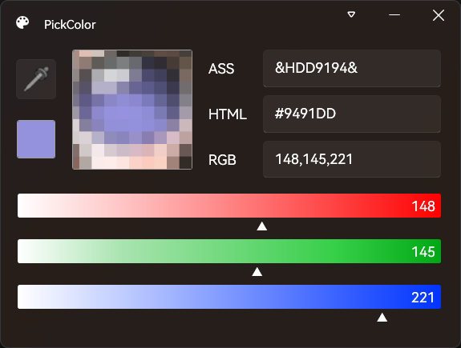

 

# PickColor

Pick your screen color simply.

## Color definitions

> Not support alpha color nowaday.

ASS format: `&HBBGGRR&`/ `&HAABBGGRR`

HTML format: `#RRGGBB`/`#RRGGBBAA`

## Screen Shot

## Usage

Press the mouse down on the eyedropper without releasing it, move the mouse to the position where the color needs to be detected, and then release the mouse or press ESC.

## Thanks

Inspired by the following open source projects:

- [Fischless](https://github.com/GenshinMatrix/Fischless)
- [Aegisub](https://github.com/Aegisub/Aegisub)

- [colorpicker](https://github.com/jamesnet214/colorpicker)
